# Mindcraft Architecture Diagram

```mermaid
graph TB
    %% Application Entry
    MAIN[main.js<br/>Application Entry]:::core
    MINDSERVER[MindServer<br/>Central Hub]:::core

    %% External Systems Subgraph
    subgraph EXTERNAL["🌐 External Systems"]
        MC[Minecraft Server<br/>Game World]:::external
        LLM[LLM APIs<br/>GPT-4, Claude, Gemini, etc.]:::external
        UI[Web UI<br/>MindServer Dashboard]:::external
    end

    %% Communication Layer Subgraph
    subgraph COMM["📡 Communication Layer"]
        SOCKET[Socket.IO<br/>Real-time Communication]:::communication
        PROXY[Server Proxy<br/>Agent-Server Bridge]:::communication
    end

    %% AI Agent Internal Logic Subgraph
    subgraph AGENT_LOGIC["🤖 AI Agent Internal Logic"]
        AGENT[Agent Process<br/>Individual AI Agent]:::agent
        
        %% Perception & Memory Subgraph
        subgraph PERCEPTION["🧠 Perception & Memory"]
            VISION[Vision Interpreter<br/>Screen Analysis]:::data
            HISTORY[History<br/>Conversation Memory]:::data
        end
        
        %% Planning & Decision Making Subgraph
        subgraph PLANNING["💡 Planning & Decision Making"]
            TASKS[Task System<br/>Goal Management]:::data
            MODES[Modes<br/>Behavioral States]:::data
            PROMPTER[Prompter<br/>LLM Integration]:::data
        end
        
        %% Code Generation & Execution Subgraph
        subgraph EXECUTION["✍️ Code Generation & Execution"]
            CODER[Coder<br/>Code Generation & Execution]:::data
            ACTIONS[ActionManager<br/>Action Execution]:::data
        end
        
        %% Minecraft Interface
        BOT[Mineflayer Bot<br/>Minecraft Client]:::agent
    end

    %% Main Application Flow (Blue - System Initialization)
    MAIN -->|"🚀 Initialize"| MINDSERVER
    MAIN -->|"🚀 Initialize"| AGENT_LOGIC

    %% MindServer Connections (Purple - Central Hub)
    MINDSERVER -->|"📡 Manage"| COMM
    MINDSERVER -->|"🖥️ Serve"| UI
    MINDSERVER -->|"🤖 Control"| AGENT

    %% Communication Layer Flow (Orange - Communication)
    SOCKET -->|"📡 Real-time"| UI
    PROXY -->|"🔗 Connect"| AGENT
    PROXY -->|"📡 Report"| MINDSERVER

    %% Agent Internal Flow - Perception (Green - Data Input)
    AGENT -->|"👁️ Observe"| VISION
    AGENT -->|"🧠 Remember"| HISTORY
    VISION -->|"📊 Visual Data"| PROMPTER
    HISTORY -->|"📚 Context"| PROMPTER

    %% Agent Internal Flow - Planning (Yellow - Decision Making)
    AGENT -->|"🎯 Set Goals"| TASKS
    AGENT -->|"🎭 Set Mode"| MODES
    AGENT -->|"💭 Think"| PROMPTER
    TASKS -->|"📋 Task Context"| PROMPTER
    TASKS -->|"✅ Validate"| ACTIONS

    %% Agent Internal Flow - Execution (Red - Action Execution)
    AGENT -->|"💻 Generate"| CODER
    AGENT -->|"⚡ Execute"| ACTIONS
    AGENT -->|"🎮 Control"| BOT
    PROMPTER -->|"🤖 AI Decision"| CODER
    CODER -->|"⚡ Code Execution"| ACTIONS
    ACTIONS -->|"🎮 Game Action"| BOT

    %% LLM Integration (Cyan - External AI)
    PROMPTER -->|"🤖 Query"| LLM
    CODER -->|"🤖 Query"| LLM
    VISION -->|"🤖 Query"| LLM

    %% Code Execution Flow (Red - Game Actions)
    CODER -->|"Generate Code"| ACTIONS
    ACTIONS -->|"Execute Code"| BOT
    BOT -->|"Game Actions"| MC
    MC -->|"Game State"| BOT
    BOT -->|"State Updates"| AGENT

    %% Memory and Learning (Green - Learning)
    HISTORY -->|"Context"| CODER

    %% Behavioral Control (Yellow - Control)
    MODES -->|"Behavior Control"| ACTIONS
    MODES -->|"State Management"| BOT

    %% Multi-Agent Coordination (Purple - Coordination)
    AGENT -.->|"💬 Chat Messages"| MINDSERVER
    MINDSERVER -.->|"📤 Route Messages"| AGENT
    AGENT -.->|"📊 State Updates"| MINDSERVER
    MINDSERVER -.->|"🎯 Agent Coordination"| AGENT

    %% Styling
    classDef external fill:#e3f2fd,stroke:#1976d2,stroke-width:2px,color:#000
    classDef core fill:#f3e5f5,stroke:#7b1fa2,stroke-width:3px,color:#000
    classDef agent fill:#e8f5e8,stroke:#388e3c,stroke-width:2px,color:#000
    classDef communication fill:#fff8e1,stroke:#f57c00,stroke-width:2px,color:#000
    classDef data fill:#fce4ec,stroke:#c2185b,stroke-width:2px,color:#000

    class MC,LLM,UI external
    class MAIN,MINDSERVER core
    class AGENT,BOT agent
    class SOCKET,PROXY communication
    class PROMPTER,CODER,ACTIONS,TASKS,HISTORY,MODES,VISION data

    %% Link Styling
    linkStyle 0 stroke:#2196F3,stroke-width:3px
    linkStyle 1 stroke:#2196F3,stroke-width:3px
    linkStyle 2 stroke:#9C27B0,stroke-width:2px
    linkStyle 3 stroke:#9C27B0,stroke-width:2px
    linkStyle 4 stroke:#9C27B0,stroke-width:2px
    linkStyle 5 stroke:#FF9800,stroke-width:2px
    linkStyle 6 stroke:#FF9800,stroke-width:2px
    linkStyle 7 stroke:#FF9800,stroke-width:2px
    linkStyle 8 stroke:#4CAF50,stroke-width:2px
    linkStyle 9 stroke:#4CAF50,stroke-width:2px
    linkStyle 10 stroke:#4CAF50,stroke-width:2px
    linkStyle 11 stroke:#4CAF50,stroke-width:2px
    linkStyle 12 stroke:#FFEB3B,stroke-width:2px
    linkStyle 13 stroke:#FFEB3B,stroke-width:2px
    linkStyle 14 stroke:#FFEB3B,stroke-width:2px
    linkStyle 15 stroke:#FFEB3B,stroke-width:2px
    linkStyle 16 stroke:#FFEB3B,stroke-width:2px
    linkStyle 17 stroke:#F44336,stroke-width:2px
    linkStyle 18 stroke:#F44336,stroke-width:2px
    linkStyle 19 stroke:#F44336,stroke-width:2px
    linkStyle 20 stroke:#F44336,stroke-width:2px
    linkStyle 21 stroke:#F44336,stroke-width:2px
    linkStyle 22 stroke:#F44336,stroke-width:2px
    linkStyle 23 stroke:#00BCD4,stroke-width:2px
    linkStyle 24 stroke:#00BCD4,stroke-width:2px
    linkStyle 25 stroke:#00BCD4,stroke-width:2px
    linkStyle 26 stroke:#F44336,stroke-width:2px
    linkStyle 27 stroke:#F44336,stroke-width:2px
    linkStyle 28 stroke:#F44336,stroke-width:2px
    linkStyle 29 stroke:#F44336,stroke-width:2px
    linkStyle 30 stroke:#4CAF50,stroke-width:2px
    linkStyle 31 stroke:#FFEB3B,stroke-width:2px
    linkStyle 32 stroke:#FFEB3B,stroke-width:2px
    linkStyle 33 stroke:#9C27B0,stroke-width:2px,stroke-dasharray: 5 5
    linkStyle 34 stroke:#9C27B0,stroke-width:2px,stroke-dasharray: 5 5
    linkStyle 35 stroke:#9C27B0,stroke-width:2px,stroke-dasharray: 5 5
    linkStyle 36 stroke:#9C27B0,stroke-width:2px,stroke-dasharray: 5 5
```

## Color-Coded Data Flow Legend

### **Arrow Colors & Meanings:**
- 🔵 **Blue** - System initialization and startup
- 🟣 **Purple** - Central hub management and coordination
- 🟠 **Orange** - Communication layer and real-time messaging
- 🟢 **Green** - Data input, perception, and learning
- 🟡 **Yellow** - Planning, decision making, and control
- 🔴 **Red** - Action execution and game interactions
- 🔵 **Cyan** - External AI/LLM integration
- 🟣 **Purple (Dashed)** - Multi-agent coordination

### **Flow Patterns:**
1. **System Startup**: Blue arrows from main.js
2. **Data Perception**: Green arrows for vision and memory
3. **Decision Making**: Yellow arrows for planning and control
4. **Action Execution**: Red arrows for code generation and game actions
5. **External AI**: Cyan arrows to LLM APIs
6. **Multi-Agent**: Purple dashed arrows for coordination

## Key Components Explained

### **Core System**
- **main.js**: Application entry point, initializes MindServer and agents
- **MindServer**: Central coordination hub using Express + Socket.IO
- **Agent Process**: Individual AI agent running in separate process

### **Agent Architecture**
- **Prompter**: Handles LLM communication and prompt engineering
- **Coder**: Generates and executes JavaScript code for complex behaviors
- **ActionManager**: Manages action execution with timeout and interruption handling
- **Task System**: Defines and validates goals for agents
- **History**: Maintains conversation context and memory
- **Modes**: Controls behavioral states (idle, working, following, etc.)
- **Vision Interpreter**: Analyzes Minecraft screen for visual understanding

### **Communication Flow**
1. **User Input** → Web UI → MindServer → Agent
2. **Perception** → Vision/History → Prompter → LLM → Response
3. **Planning** → Task System → Prompter → Coder → ActionManager
4. **Execution** → ActionManager → Bot → Minecraft → Game State
5. **Multi-Agent Chat** → Agent → MindServer → Route to Other Agents
6. **State Coordination** → Agent → MindServer → Broadcast to All Agents

### **Data Flow Patterns**
- **🧠 Perception**: Vision + History → Context for Decision Making
- **💡 Planning**: Tasks + Modes → Goal Setting + Behavior Control  
- **✍️ Execution**: Prompter → Coder → ActionManager → Bot
- **🔄 Feedback**: Game State → Bot → Agent → Learning Loop

### **Key Features**
- **Autonomous Play**: Agents make independent decisions
- **Code Generation**: Write and execute custom JavaScript behaviors
- **Multi-Agent Coordination**: Multiple agents working together
- **Real-time Communication**: Socket.IO for instant updates
- **Memory Management**: Persistent conversation history
- **Task Management**: Complex goal setting and validation
